# Product Hands-on Lab - AI Data Platform

## What You Will Learn

Throughout this workshop, you will build a **multi-agent AI data platform** for the fictional *Contoso* / *Mimosa Gravel* retailer. A single **orchestrator agent** answers business questions by grounding its reasoning on company knowledge and by delegating specialized questions to a dedicated Fabric Data Agent, the whole system being reachable from a local chat UI.

### Architecture

The orchestrator agent is the single entry point the user talks to. It combines three complementary capabilities you build lab after lab:

- **Company guidelines** — a managed vector store in Foundry IQ that keeps product and sales reports aligned with the company standards.
- **Company documents** — an identity-aware Foundry IQ knowledge base over Azure AI Search, where per-user document permissions are enforced at retrieval time.
- **Business data** — a Fabric Data Agent, connected over MCP, that answers sales and product questions from a semantic model and a lakehouse.

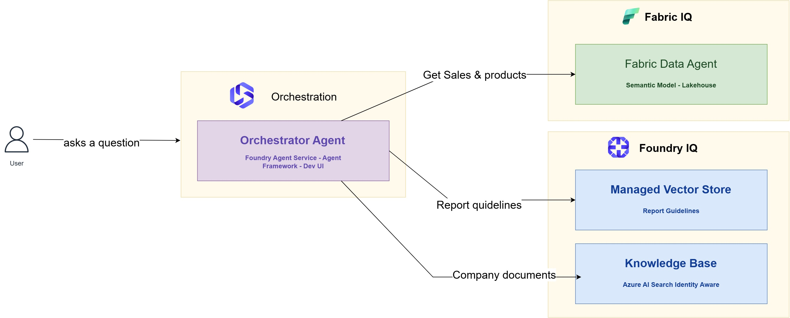

### Key Technologies

- **Microsoft Foundry** & **Foundry IQ** — agent hosting, managed vector stores, knowledge sources and bases, and agentic retrieval.
- **Microsoft Agent Framework** & **DevUI** — building the orchestrator agent and testing it locally without writing a front-end.
- **Azure AI Search** — vector and semantic search with document-level security trimming.
- **Microsoft Fabric** & **Fabric Data Agents** — natural-language querying over a semantic model and a lakehouse.
- **Model Context Protocol (MCP)** — connecting the orchestrator agent to the Fabric Data Agent.
- Bonus: Discover **Microsoft Fabric RTI** — real-time ingestion and analytics with Eventstream, Eventhouse, and KQL.

---

## Prerequisites

Before starting this lab, be sure to set your Azure environment :

- An Azure Subscription with the **Contributor** role to create and manage the labs' resources and deploy the infrastructure as code
- Register the Azure providers on your Azure Subscription if not done yet: `Microsoft.CognitiveServices`, `Microsoft.Search`, `Microsoft.Storage`, `Microsoft.KeyVault`, `Microsoft.ManagedIdentity`,`Microsoft.Fabric`.

To retrieve the lab content :

- A GitHub account (Free, Team or Enterprise)
- From the workshop repository on GitHub, open the **Releases** page and [download starter.zip][repo-starter] from the latest **Starter Lab** release, then unzip it.

3 development options are available:
  - 🥇 *Preferred method* : Pre-configured GitHub Codespace 
  - 🥈 Local Devcontainer
  - 🥉 Local Dev Environment with all the prerequisites detailed below

<div class="tip" data-title="Tips">

> To focus on the main purpose of the lab, we encourage the usage of devcontainers/codespace as they abstract the dev environment configuration, and avoid potential local dependencies conflict.
>
> You could decide to run everything without relying on a devcontainer : To do so, make sure you install all the prerequisites detailed below.

</div>

### 🥇 : Pre-configured GitHub Codespace

To use a GitHub Codespace, you will need :

- [A GitHub Account][github-account]

Create a **new GitHub repository** in your GitHub account, unzip the starter project and push it to your new repository. Then, you can create a new GitHub Codespace from your repository.

GitHub Codespace offers the ability to run a complete dev environment (Visual Studio Code, Extensions, Tools, Secure port forwarding etc.) on a dedicated virtual machine.
The configuration for the environment is defined in the `.devcontainer` folder, making sure everyone gets to develop and practice on identical environments : No more conflict on dependencies or missing tools !

Every GitHub account (even the free ones) grants access to 120 vcpu hours per month, _**for free**_. A 2 vcpu dedicated environment is enough for the purpose of the lab, meaning you could run such environment for 60 hours a month at no cost!

To get your codespace ready for the labs, here are a few steps to execute :

- After you pushed the code to your new repository, click on `<> Code`, `Codespaces` tab and then click on the `+` button:

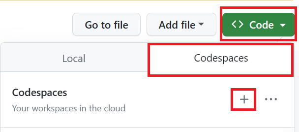

- You can also provision a beefier configuration by defining creation options and select the **Machine Type** you like :

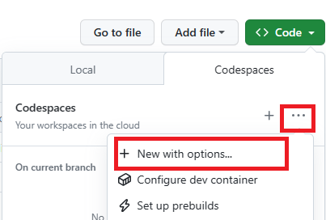

### 🥈 : Using a local Devcontainer

This starter comes with a Devcontainer configuration that will let you open a fully configured dev environment from your local Visual Studio Code, while still being completely isolated from the rest of your local machine configuration : No more dependancy conflict.
Here are the required tools to do so :

- [Git client][git-client]
- [Docker Desktop][docker-desktop] running
- [Visual Studio Code][vs-code] installed on your machine

Make sure Docker Desktop is up and running and open the cloned repository in Visual Studio Code.

Unzip the starter project and open the local folder in Visual Studio Code. You will be prompted to open the project in a Dev Container. Click on `Reopen in Container`.

If you are not prompted by Visual Studio Code, you can open the command palette (`Ctrl + Shift + P`) and search for `Reopen in Container` and select it:

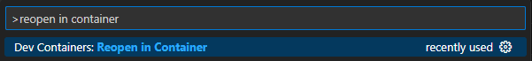

### 🥉 : Using your own local environment

The following tools and access will be necessary to run the lab on a local environment:  

<div class="tip" data-title="Windows note">

> If you're installing prerequisites with `winget`, open **Windows PowerShell as Administrator**.

</div>

- [Git client][git-client]
- [Visual Studio Code][vs-code] installed
- [Azure CLI][az-cli-install] installed on your machine
- [Python 3.13][download-python] installed on your machine
- [UV package manager][download-uv] installed on your machine
- [Terraform][download-terraform] installed on your machine
- [Fabric CLI][ms-fabric-cli] installed on your machine

Visual Studio Code Extensions to install :

- [ms-python.python][ms-python-extension]
- [github.copilot][github-copilot-extension]
- [github.copilot-chat][github-copilot-chat-extension]
- [ms-python.vscode-pylance][ms-python-vscode-pylance-extension]
- [ms-vscode-remote.remote-containers][ms-vscode-remote-containers-extension]
- [charliermarsh.ruff][charliermarsh-ruff-extension]
- [ms-python.debugpy][ms-python-debugpy-extension]
- [hashicorp.terraform][hashicorp-terraform-extension]

Once you have set up your local environment, you can unzip the starter project on your machine, and open the local folder in Visual Studio Code and head to the next step.

### Sign in to Azure

> - Log into your Azure subscription in your environment using Azure CLI and on the [Azure Portal][az-portal] using your credentials.
> - Instructions and solutions will be given for the Azure CLI, but you can also use the Azure Portal if you prefer.
> - Register the Azure providers on your Azure Subscription if not done yet: `Microsoft.CognitiveServices`

```bash
# Login to Azure : 
# --tenant : Optional | In case your Azure account has access to multiple tenants

# Option 1 : Local Environment 
az login --tenant <yourtenantid or domain.com>
# Option 2 : Github Codespace : you might need to specify --use-device-code parameter to ease the az cli authentication process
az login --use-device-code --tenant <yourtenantid or domain.com>

# Display your account details
az account show
# Select your Azure subscription
az account set --subscription <subscription-id>

# Register the following Azure providers if they are not already

# Azure Cognitive Services
az provider register --namespace 'Microsoft.CognitiveServices'

# Azure Search
az provider register --namespace 'Microsoft.Search'

# Azure Storage
az provider register --namespace 'Microsoft.Storage'

# Azure Key Vault
az provider register --namespace 'Microsoft.KeyVault'

# Azure Managed Identity
az provider register --namespace 'Microsoft.ManagedIdentity'

# Azure Fabric
az provider register --namespace 'Microsoft.Fabric'
```

### Deploy the infrastructure

First, you need to initialize the terraform infrastructure by running the following command:

```bash
# Run the following line which will dynamically set the subscription ID as an environment variable:
export ARM_SUBSCRIPTION_ID=$(az account show --query id -o tsv)

# Initialize terraform
cd infra && terraform init
```

Then run the following command to deploy the infrastructure:

```bash
# Apply the deployment directly
terraform apply -auto-approve
```

The deployment should take a few minutes to complete.

### Enable Fabric items and OpenAI in Microsoft Fabric 

In order to use/develop any Fabric Items and use Fabric Data Agents, a few prerequisites must be respected. 

1. You will need administrator rights on Fabric to enable Fabric items and OpenAI. Go to [https://app.fabric.microsoft.com](https://app.fabric.microsoft.com) and sign in.
2. On top right, open **Settings**, and at the bottom of the pane find **Admin Portal**
3. In the left menu pane, find **Tenant Settings** (must be where you land by default, if you are fabric admin)
4. Enable multiple features : (First one at the top) **Users can create Fabric items** (either for the entire organization, or for a specific security group)
5. Select **Apply**.
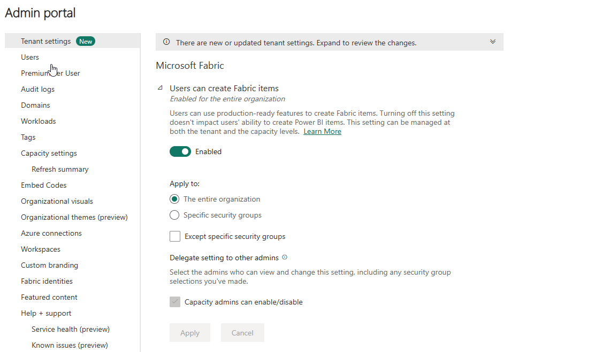
6. Now, using the search bar on the right type: `open`. 
7. Enable all 4 menus in the **Copilot and Azure OpenAI Service** list. 
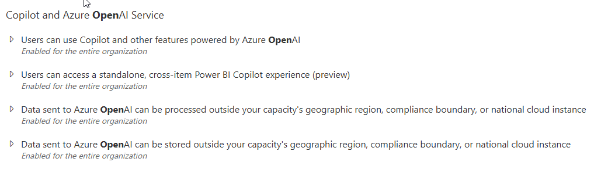
8. Select **Apply** and leave the admin portal. 

[ms-python-extension]: https://marketplace.visualstudio.com/items?itemName=ms-python.python
[github-copilot-extension]: https://marketplace.visualstudio.com/items?itemName=GitHub.copilot
[github-copilot-chat-extension]: https://marketplace.visualstudio.com/items?itemName=GitHub.copilot-chat
[ms-python-vscode-pylance-extension]: https://marketplace.visualstudio.com/items?itemName=ms-python.vscode-pylance
[charliermarsh-ruff-extension]: https://marketplace.visualstudio.com/items?itemName=charliermarsh.ruff
[ms-python-bandit-extension]: https://marketplace.visualstudio.com/items?itemName=ms-python.bandit
[ms-python-debugpy-extension]: https://marketplace.visualstudio.com/items?itemName=ms-python.debugpy
[hashicorp-terraform-extension]: https://marketplace.visualstudio.com/items?itemName=hashicorp.terraform
[ms-vscode-remote-containers-extension]: https://marketplace.visualstudio.com/items?itemName=ms-vscode-remote.remote-containers
[az-cli-install]: https://learn.microsoft.com/en-us/cli/azure/install-azure-cli
[az-portal]: https://portal.azure.com
[vs-code]: https://code.visualstudio.com/
[azure-function-vs-code-extension]: https://marketplace.visualstudio.com/items?itemName=ms-azuretools.vscode-azurefunctions
[docker-desktop]: https://www.docker.com/products/docker-desktop/
[repo-starter]: https://github.com/damienaicheh/hands-on-lab-data-platform/releases
[git-client]: https://git-scm.com/downloads
[github-account]: https://github.com/join
[download-python]: https://www.python.org/downloads/
[download-uv]: https://docs.astral.sh/uv/
[download-terraform]: https://developer.hashicorp.com/terraform/install
[ms-fabric-cli]: https://github.com/microsoft/fabric-cli

---

## Setup Foundry IQ

### The starter project

You do not start from an empty folder: the workshop provides a starter project where the code you have to write is marked with `# TODO` comments (a few placeholders keep a `raise NotImplementedError` where Python needs a statement to stay valid). 

Each step in the labs points you to a file, explains why the code matters, and then gives you the exact snippet to write in place of the `# TODO` you find there.

### Update the `.env` file

The project reads its configuration from a `.env` file, but at this point you only have the template `src/.env.template`. Start by duplicating it and renaming the copy to `.env`:

```bash
cp src/.env.template src/.env
```

You do not have to fill everything at once. A few values are produced while you work through the labs (for example `VECTOR_STORE_ID`, which Lab 1 generates). Most of the others come from the resources that were deployed for the workshop, and the easiest way to read them is to browse those resources in the Azure portal. Open the portal, go to **Resource groups**, and select the resource group provisioned for this workshop. It holds a handful of resources, and you will pick one value from each.

#### From the Azure AI Search service

Select the **Search service** in the resource group. On the **Overview** blade, copy the **Url** (it looks like `https://<name>.search.windows.net`) into `SEARCH_ENDPOINT`.

#### From the Foundry resource

Select the **Foundry Project** resource, then open it in the [Go to Foundry portal](https://ai.azure.com) with **Go to Azure AI Foundry portal**.

- On the project **Home** page, copy the project endpoint (`https://<resource>.services.ai.azure.com/api/projects/<project>`) into `FOUNDRY_PROJECT_ENDPOINT`. The shorter base of that same URL, `https://<resource>.services.ai.azure.com`, goes into `FOUNDRY_ENDPOINT`.
- Still in the  **Home** page copy the Azure OpenAI endpoint (`https://<resource>.openai.azure.com/`); copy it into `AOAI_ENDPOINT`.

#### From the Storage Account

Select the ADLS Gen2 **Storage account** starting with the prefix `stsearch` in the resource group.

- Inside the **Endpoints** tab, copy the **Blob service** URL (`https://<account>.blob.core.windows.net`) into `BLOB_ACCOUNT_URL`.
- Inside **Overview** on top right click on **Json View**, copy the storage account **Resource ID** and wrap it as `ResourceId=<id>;` in `BLOB_DATASOURCE_CONNECTION_STRING`.

#### From Microsoft Entra ID

For the purpose of the labs, you will need 2 groups, one to represent all participants and one to represent the restricted documents. You can create them yourself or ask whoever provisioned the workshop to create them for you.

If you need to create them yourself, follow these steps:

```bash
az ad group create --display-name "Contoso-RestrictedDocs" --mail-nickname "contoso-restricteddocs"
```

Add yourself as a user to the Entra ID group

```bash
az ad group member add --group "<group-id>" --member-id "<user-object-id>"
```

When you are done, you should have two groups in your Entra ID, one for all participants and one for the restricted documents.

In the portal, search for **Microsoft Entra ID** and open **Groups**. Find your 2 groups, open each one, and copy its **Object ID** into `RESTRICTED_DOCS_GROUP_ID` (the restricted-documents group) and `ALL_PARTICIPANTS_GROUP_ID` (the all-participants group) inside your `.env` file.

### Seed the Azure AI Search index

Before touching any lab, you need data to work with. The workshop ships a ready-to-run script that uploads the sample documents to storage and builds the Azure AI Search index the agent will query later, including the document-level access rules.

```bash
cd src/seed_ai_search
# Get the project dependencies and create a virtual environment
uv sync
# Activate the virtual environment
source .venv/bin/activate
# Run the script to upload the documents and create the index
uv run python main_create_index.py
```

`uv sync` installs the project dependencies into a local virtual environment. You only need it the first time you work in a given folder; on later runs from the same folder you can skip it and call `uv run` directly. The script then uploads the documents, creates the data source, index, skillset and indexer, and polls the indexer until ingestion completes.

<div class="task" data-title="Validation">

> Wait for the script to report that the indexer has finished. In the Azure portal, inside your resource group, open the Search service, go to **Indexes**, and confirm the index appeated with few documents in it.

</div>

---

## Foundry IQ Managed

In this lab, you create a managed vector store in Foundry IQ. This kind of vectors allows you to quickly vectorize and search documents with a generic approach. This is perfect for use cases like sharing guidelines, where you want to make sure the agent follows the company standards when writing reports.

### What You Will Learn

- Create an `AIProjectClient` and get an OpenAI-compatible client from it.
- Upload local guideline files to Foundry.
- Create a managed vector store from those files.
- Put a first orchestrator agent in front of that store and test it end to end.

### Files To Open

This lab spans two files, which you edit in order:

- `src/foundry_iq/main_managed_index.py` — build the vector store.
- `src/agents/main.py` — wire a first version of the orchestrator agent that searches it.

Both files already load the environment variables, configure logging, and set up the boilerplate for you. You only fill the placeholders called out below.

### Create the Managed Index

#### Create The Project Client

Open `src/foundry_iq/main_managed_index.py` and find the first Lab 1 placeholder.

The `AIProjectClient` is your entry point to the Foundry project. It authenticates with `DefaultAzureCredential`, which reuses your Azure CLI sign-in locally and a managed identity once deployed, so you never store a key in the code. From that client you get an OpenAI-compatible client, which exposes the familiar `files` and `vector_stores` APIs you will use next.

Replace it with:

```python
project_client = AIProjectClient(
    endpoint=os.environ["FOUNDRY_PROJECT_ENDPOINT"],
    credential=DefaultAzureCredential(),
)
openai_client = project_client.get_openai_client()
```

Reading the endpoint from the environment keeps the same code working across every environment, because only the `FOUNDRY_PROJECT_ENDPOINT` value changes.

#### Upload The Guideline Files

Before Foundry can index the guidelines, the raw markdown files must exist on the service side. Let's upload the contoso guidelines already prepared in the `files` folder.
 Find the second Lab 1 placeholder and upload each file, keeping the returned identifiers.

Replace it with:

```python
file_ids = []
for file_path in file_paths:
    logger.info("📄 Uploading %s ...", file_path)
    with open(file_path, "rb") as f:
        file = openai_client.files.create(file=f, purpose="assistants")
    file_ids.append(file.id)
```

The `purpose="assistants"` value tells Foundry these files are meant to be used as knowledge for assistants, not for another workflow such as fine-tuning. You collect every `file.id` because the vector store is built from those ids, not from the local paths.

Then create the vector store from the uploaded files:

```python
vector_store = openai_client.vector_stores.create(
    name="report-writing-guidelines-vector-store", file_ids=file_ids
)
logger.info("✅ Created vector store id: %s", vector_store.id)
```

Foundry chunks and embeds each file automatically, so a single call is enough to get a store the agent can query semantically. The store keeps a stable id that will be used by your agent.

#### Run The Script

```bash
cd src/foundry_iq
# Get the project dependencies and create a virtual environment
uv sync
source .venv/bin/activate
# Run the script to upload the files and create the vector store
uv run python main_managed_index.py
```

`uv sync` pulls the project dependencies the first time you enter this folder; you can skip it on the next runs from `src/foundry_iq`. The logs print the created vector store id.

<div class="task" data-title="Validation">

> The script should log `✅ Created vector store id: ...`.
>
> Copy that id and save it in your `.env` file as `VECTOR_STORE_ID`. The agent you will create during the next step needs it to reach the guidelines.

</div>

You can go to Foundry portal inside **Build** > **Knowledge** > **Indexes** to confirm the files were uploaded successfully:

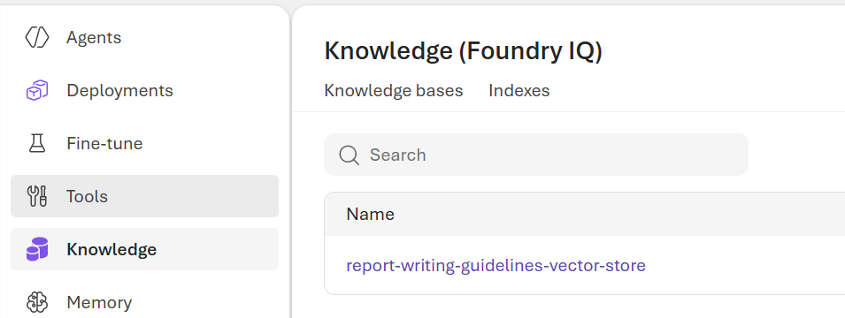

### Consume the Managed Index

Open `src/agents/main.py`. It already registers the agent in Foundry and starts DevUI for you. 

<div class="tip" data-title="DevUI">

> DevUI is a local web app that lets you chat with the agent and see its reasoning. It is automatically launched when you run the agent, so you can test it end-to-end without writing any front-end code.

</div>

#### Create The Foundry Chat Client

Find the first Lab 1 placeholder in `src/agents/main.py`.

The `FoundryChatClient` is the bridge between the agent framework and your Foundry model deployment. It carries the same `credential` used everywhere else, so the agent runs with the caller identity rather than a shared key.

Replace it with:

```python
foundry_client = FoundryChatClient(
    project_endpoint=project_endpoint,
    model=model_deployment,
    credential=credential,
)
```

#### Expose The Guidelines As A Tool

Next step is to turn the vector store you just created into a tool the agent can call on demand. When the agent decides it needs the report-writing guidelines, it uses this store instead of relying on the model memory, which keeps the reports aligned with the company standards.

Find the second Lab 1 placeholder, replace it with:

```python
company_guidelines_tool = foundry_client.get_file_search_tool(
    vector_store_ids=[vector_store_id]
)
tools: List[ToolTypes] = [company_guidelines_tool]
```

Here the pieces come together: the chat client drives the model and the tool gives the agent explicit access to the guidelines. You gather the tools in a single `tools` list because later labs (the Fabric Data Agent) append more tools to that same list. The agent starts with an empty `context_providers` list, you will update it later.

Find the last Lab 1 placeholder, replace it with:

```python
orchestrator_agent = Agent(
    name=agent_name,
    client=foundry_client,
    context_providers=context_providers,
    tools=tools,
)
```

### Run The Agent

```bash
cd src/agents
# Get the project dependencies and create a virtual environment
source .venv/bin/activate
uv sync
# Run the agent to open DevUI
uv run python main.py
```

`uv sync` installs this project dependencies the first time you enter the `src/agents` folder. DevUI then opens automatically so you can chat with the orchestrator agent.

<div class="task" data-title="Validation">

> Ask the agent: "What are the guidelines for Naming and Formatting Conventions on Contoso products?" and confirm it searches the product guidelines before writing, and that the result follows them.

</div>

---

## Create Knowledge sources

The vector store you just built covers internal writing guidelines. In this lab, you add two more retrieval sources to Foundry IQ, and they play complementary roles:

- an **Azure AI Search source** over the company documents that were indexed at startup. This is where the agent will look first, to ask for company content.
- a **web source** used as a fallback, so when the answer is not in the indexed documents the agent can still ground it on trusted public documentation instead of guessing.

A knowledge source is just a named connector that tells Foundry IQ *where* to look. On their own, these two sources are not enough: the agent needs a single entry point that knows to try the company documents first and fall back to the web when needed. That is exactly why, in the next lab, you group both sources into one knowledge base.

### What You Will Learn

- Define a web knowledge source with allowed and blocked domains.
- Define a search-index knowledge source backed by an existing Azure AI Search index.
- Register both sources in Foundry IQ.

### Files To Open

You only need to edit this file:

- `src/foundry_iq/main_knowledge_base.py`

### Define The Web Knowledge Source

Open `src/foundry_iq/main_knowledge_base.py` and find the Lab 2 placeholder inside `create_web_knowledge_source(...)`.

A web knowledge source lets the agent ground its answers in live documentation instead of guessing. The allow and block lists matter: you explicitly trust `bing.com` (including its subpages) and explicitly refuse `google.com`, so the agent cannot wander onto general search results. This keeps answers relevant and predictable.

Replace it with:

```python
knowledge_source = WebKnowledgeSource(
    name=WEB_KNOWLEDGE_SOURCE_NAME,
    description="A sample Web Knowledge Source.",
    encryption_key=None,
    web_parameters=WebKnowledgeSourceParameters(
        domains=WebKnowledgeSourceDomains(
            allowed_domains=[
                WebKnowledgeSourceDomain(
                    address="bing.com", include_subpages=True
                )
            ],
            blocked_domains=[
                WebKnowledgeSourceDomain(address="facebook.com", include_subpages=True),
                WebKnowledgeSourceDomain(address="x.com", include_subpages=True),
            ],
        )
    ),
)

index_client.create_or_update_knowledge_source(knowledge_source)
logger.info(
    f"Knowledge source '{knowledge_source.name}' created or updated successfully."
)
```

Using `create_or_update_knowledge_source` makes the script safe to run several times: it creates the source the first time and updates it on the next runs instead of failing.

### Define The Search-Index Knowledge Source

Still in the same file, find the Lab 2 placeholder inside `create_index_knowledge_source(...)`.

This source points Foundry IQ at the Azure AI Search index that already holds the company documents. You describe which fields carry the content (`chunk`) and the title, and which semantic configuration to use, so Foundry IQ knows how to retrieve and rank the most relevant passages.

Replace it with:

```python
knowledge_source = SearchIndexKnowledgeSource(
    {
        "name": AI_SEARCH_KNOWLEDGE_BASE_NAME,
        "kind": "searchIndex",
        "description": (
            f"Knowledge source backed by the '{INDEX_NAME}' Azure AI Search index."
        ),
        "searchIndexParameters": {
            "searchIndexName": INDEX_NAME,
            "semanticConfigurationName": SEMANTIC_CONFIGURATION_NAME,
            "sourceDataFields": [{"name": "title"}, {"name": "chunk"}],
            "searchFields": [{"name": "chunk"}],
        },
    }
)

index_client.create_or_update_knowledge_source(knowledge_source)
logger.info(f"Knowledge source '{AI_SEARCH_KNOWLEDGE_BASE_NAME}' ready.")
```

<div class="tip" data-title="Why two field lists?">

> `searchFields` is where Foundry IQ runs the query, while `sourceDataFields` is what it reads back to build the answer. Separating them lets you search only the chunk text but still return the title alongside each result.

</div>

Do not run the script yet. It also needs the knowledge base you build in the next lab, so move on before executing it end-to-end.

---

## Create Knowledge bases with agent retrieval

The two knowledge sources are registered, but the agent cannot query them directly. In this lab, you create a Foundry IQ knowledge base that groups both sources behind a single name and adds the reasoning model that turns retrieved passages into a final answer.

### What You Will Learn

- Group several knowledge sources into one knowledge base.
- Configure answer synthesis so Foundry IQ returns a written answer, not just raw chunks.
- Attach a Foundry model to the knowledge base.

### Files To Open

You stay in the same file:

- `src/foundry_iq/main_knowledge_base.py`

Complete the Lab 3 placeholder inside `create_knowledge_base(...)`.

### Define and Create The Knowledge Base

The knowledge base is what the agent actually talks to. A knowledge base can have multiple sources, and it can be configured to return either raw passages or a synthesized answer. This answer is made by the agentic retrieval model you attach to the knowledge base, which reads the retrieved passages and writes a concise, citation-backed answer.

The advantage of Knowledge Bases is that you can share it across multiple agents, and you can change the sources or the model without touching the agents themselves.

You can also create multiples knowledge bases, by using different sources or different models and use them based on your use case. This is a good way to build multiple scenario based on the same sources, but with different models or different answer instructions.

Open `src/foundry_iq/main_knowledge_base.py` and find the Lab 3 placeholder, replace it with:

```python
knowledge_base = KnowledgeBase(
    {
        "name": KNOWLEDGE_BASE_NAME,
        "description": (
            "Foundry IQ knowledge base over the Azure AI Search index."
        ),
        "knowledgeSources": [
            {"name": WEB_KNOWLEDGE_SOURCE_NAME},
            {"name": AI_SEARCH_KNOWLEDGE_BASE_NAME},
        ],
        "outputMode": "answerSynthesis",
        "answerInstructions": (
            "Provide a concise, citation-backed answer based on the "
            "retrieved documents."
        ),
        "models": [
            {
                "kind": "azureOpenAI",
                "azureOpenAIParameters": {
                    "resourceUri": FOUNDRY_ENDPOINT,
                    "deploymentId": CHAT_MODEL_DEPLOYMENT,
                    "modelName": CHAT_MODEL_DEPLOYMENT,
                },
            }
        ],
        "retrievalReasoningEffort": {"kind": "low"},
    }
)

result = index_client.create_or_update_knowledge_base(knowledge_base)
logger.info(f"Knowledge base '{KNOWLEDGE_BASE_NAME}' ready.")
return result
```

It lists the sources to search (both the web source and the search-index source you defined in previous lab, and because `outputMode` is set to `answerSynthesis`, Foundry IQ uses the configured model to read the retrieved passages and write a concise, citation-backed answer. Pointing the model block at `FOUNDRY_ENDPOINT` and `CHAT_MODEL_DEPLOYMENT` keeps deployment details in configuration rather than hard-coded here.

`retrievalReasoningEffort` set to `low` keeps retrieval fast and inexpensive, which is a good default for a workshop. You can raise it later when you need deeper multi-step reasoning over the sources.

### Run The Script

Now that the sources and the knowledge base are all defined, run the whole file:

```bash
cd src/foundry_iq
uv run python main_knowledge_base.py
```

<div class="task" data-title="Validation">

> The logs should confirm that both knowledge sources and the knowledge base are created or updated.
>
> The script also prints the knowledge base definition as JSON, so you can double-check the sources and the model it references.

</div>

If you go to Foundry portal inside **Build** > **Knowledge** > **Knowledge Bases**, you should see the `contoso-knowledge-base` knowledge base you just created:

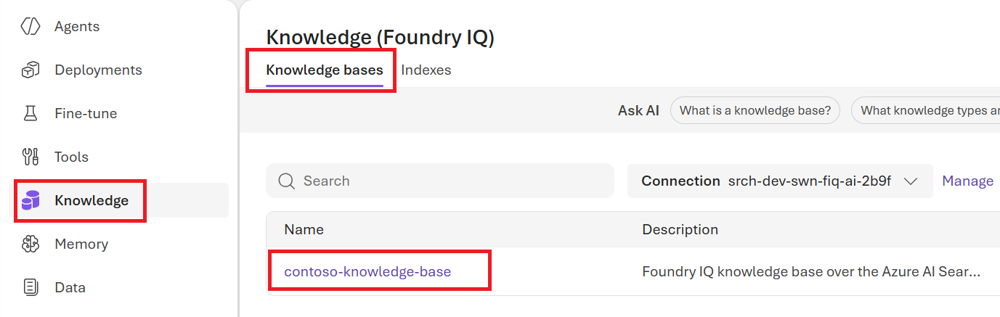

If you click on it, you can see the two sources and the model it uses for answer synthesis:

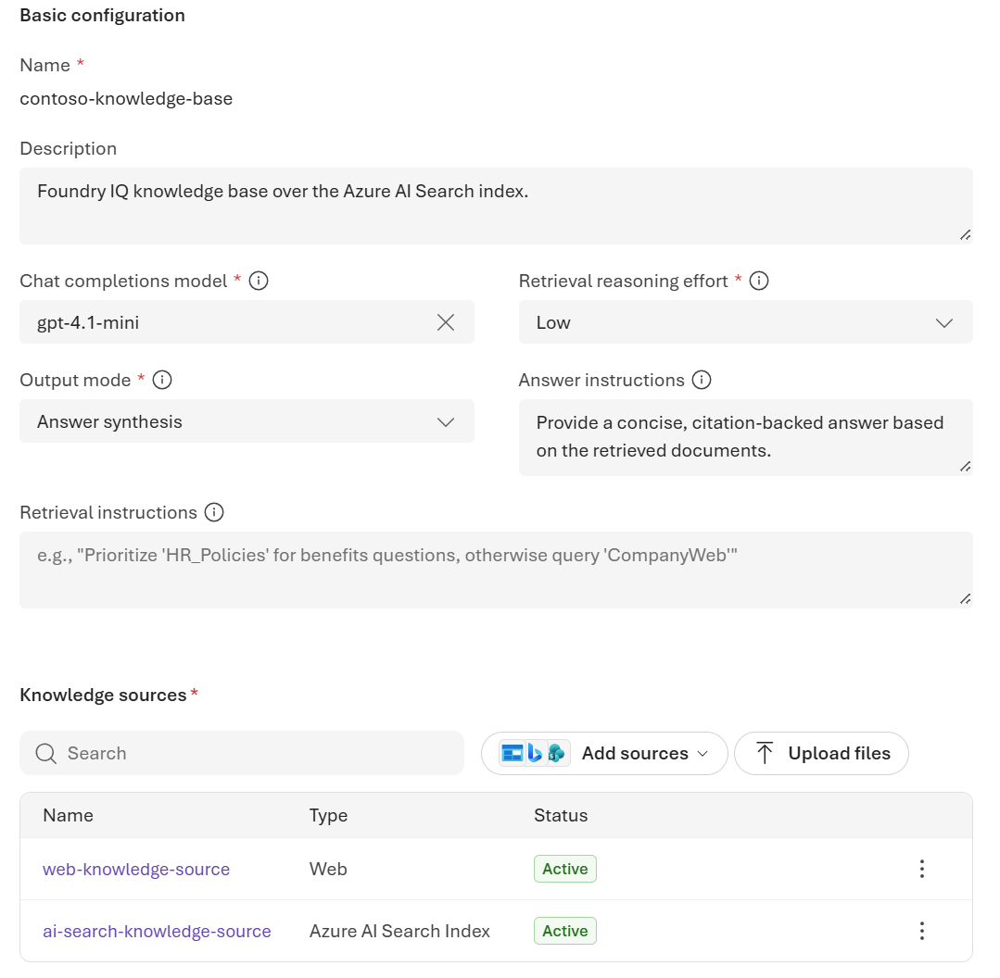

Also, you can see it direcly inside your AI Search instance:

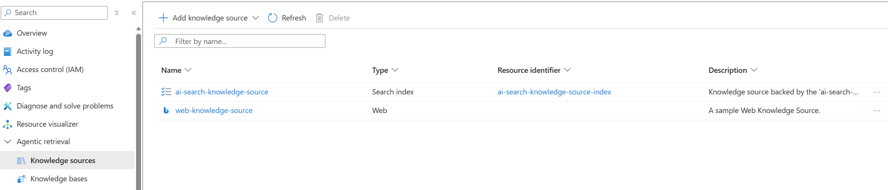

And also the knowledge base itself:

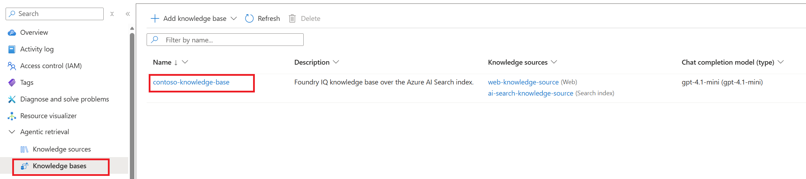

If you click on it, you will see that you have also a playground to test it directly from the Azure AI Search portal.

---

## Access data from the index based on the user / agent

Your orchestrator agent already retrieves the report-writing guidelines from the managed indexed you built previously. In this final lab, you will connect it to the knowledge base you just created.

### What You Will Learn

- Add an identity-aware Azure AI Search context provider to the existing agent.
- Enforce per-user document permissions at retrieval time.

### Files To Open

You will need the same file you edited in the previous lab:

- `src/agents/main.py`

The chat client, the guidelines tool and the agent wiring are already there from previous labs. You only complete the remaining Lab 4 placeholder that will plug the identity-aware search provider into the agent.

### Add The Identity-Aware Search Provider

A context provider automatically enriches the conversation with relevant knowledge before the model answers. This one runs in `agentic` mode by using the knowledge base you created previously, so retrieval and answer synthesis happen through Foundry IQ. The important detail is that it is identity-aware: it propagates the signed-in user identity to Azure AI Search, so document-level permissions are enforced and each user only retrieves what they are allowed to see. Assigning it to `context_providers` is what adds it to the agent you wired in Lab 1.

Open `src/agents/main.py` and find the Lab 4 placeholder, replace it with:

```python
aisearch_context_provider = IdentityAwareAzureAISearchContextProvider(
    source_id="search_provider",
    endpoint=search_endpoint,
    credential=credential,
    mode="agentic",
    knowledge_base_name=knowledge_base_name,
    knowledge_base_output_mode="answer_synthesis",
    retrieval_reasoning_effort="low",
)
context_providers = [aisearch_context_provider]
```

<div class="tip" data-title="Why identity-aware retrieval matters">

> Without identity propagation, every user would query Azure AI Search with the same application identity and could read restricted documents. Passing the user identity down to the search call is what makes per-user document trimming possible.

</div>

### Run The Agent

```bash
cd src/agents
uv run python main.py
```

DevUI opens again so you can chat with the full orchestrator agent.

<div class="task" data-title="Validation">

> Ask a question that should rely on the indexed company documents and confirm the answer uses that content.
>
> Sign in as different users and confirm the Azure AI Search results are trimmed according to each user document permissions.

</div>

If you ask content that are inside the restricted documents, you should see that the answer is different based on the user you are signed in with.

For instance "What is the Q3 2026 Event Budget Tracker ?" should return the content of the document if you are signed in as a user that has access to it, otherwise the agent should answer that it cannot find any information about it.

You can test this easily by adding and removing yourself from the `Contoso-RestrictedDocs` group in Microsoft Entra ID, and then signing in again to the agent.

---

## Setup Fabric IQ

### What you will learn in this lab

In order to demonstrate the capabilities of Agentic Features in Microsoft Fabric, we first need to deploy a set of items : 
- You will create a fabric workpsace to regroup all of our items in the same functional container. 
- You will upload two notebooks to automate the creation of the necessary items (Storage Layer, Semantic Layer, Reports)
- And you will load fake data. Data represents an international bike retailer : multi-channel sellers, across different points of sales, and analysis of Sales, Returns, and patterns for products or customers. 

In order to be efficient with your Fabric Data Agent and be able to analyse our business, you first need to deploy the AI-Ready data layer.

Once the fundations are prepared, you will then create a Fabric Data Agent, benefit from the semantic model, enhence it's understanding of the model with instructions, increase it's scope of action thanks to data in the Lakehouse, and even teach how to query data in specific case, to decrease halucinations and increase deterministic analysis. 

### Create a workspace in a Fabric Capacity

A workspace is the container for all your Fabric items (notebooks, models, reports, and agents).

1. Go to [Fabric Portal](https://app.fabric.microsoft.com/home?experience=fabric-developer) and sign in.
2. Click on **+ New workspace**.
3. Give it a clear **name** (for example, `Data Agent Workshop`).
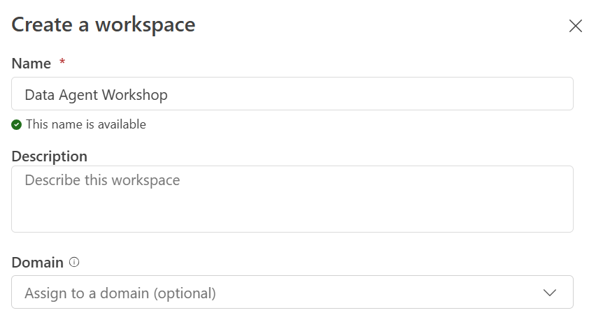
4. In the **Details**, choose your **Fabric capacity**. It must be the one in the resource group you deployed for this workshop.
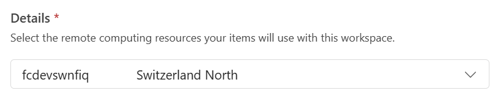
5. Leave the rest of the options as default. Select **Apply**.

<div class="warning" data-title="Important">

> The workspace **must** be assigned to a Fabric capacity — Data Agents will not run on a Pro/shared workspace.

</div>

### Import the Notebooks

You will import **two** notebooks that quick start the labs, create all the items, and load data into your environment:

- **NB - Bootstrap Workspace** — orchestrates the setup: creates the lakehouse, rebinds and runs the data notebook, then creates the semantic model and report.
- **NB - Mimosa Gravel Data Generator** — the data generator/loader that builds the lakehouse tables you'll query. It is run automatically by the Bootstrap notebook, so you don't run it yourself.

These files are located in the `src/seed_fabric` folder of the starter project you cloned.

1. Inside your new workspace, select **Import** → **Notebook** → **From this computer** (or **Upload**).
2. Choose **both** provided `.ipynb` notebooks and confirm. Make sure they both appear in the workspace before continuing.
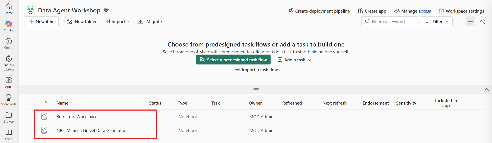
3. Open the **NB - Bootstrap Workspace** notebook.
4. At the top, click **Run all** to execute every cell. Wait for the notebook to finish before continuing. 


> The Bootstrap notebook automatically generates the necessary items to be able to create the data agent, but it does not create data. We now need to generate our data ! 

5. When the execution is done, close the notebook (top left **X**) you will automatically go back to the workspace. You should be able to see a new lakehouse, a semantic model, and a report inside your workspace. 
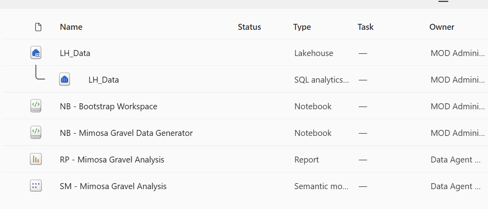

6. Open the **NB - Mimosa Gravel Data Generator** notebook. First, on the left pane, remove the old lakehouse (it always belongs to a lakehouse). Next to the error logo, click remove. 
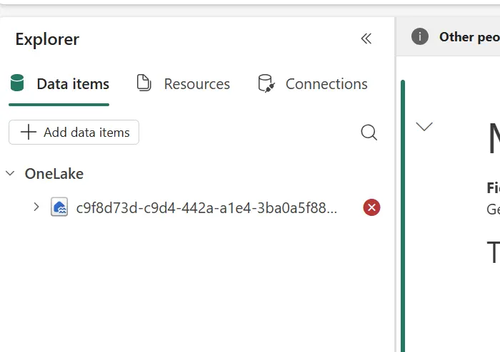
7. Bind the notebook to the newly created lakehouse : 
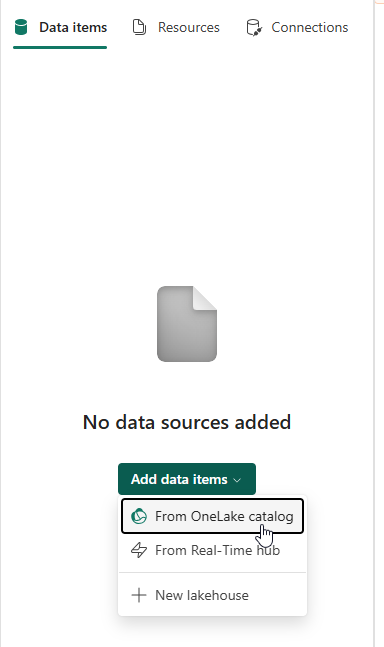

8. From the explorer, chose the right workspace, find the lakehouse, and check the corresponding box to bind it to the notebook. Be careful, there are two similar items but with different icons. Take the one with waves in the design. 
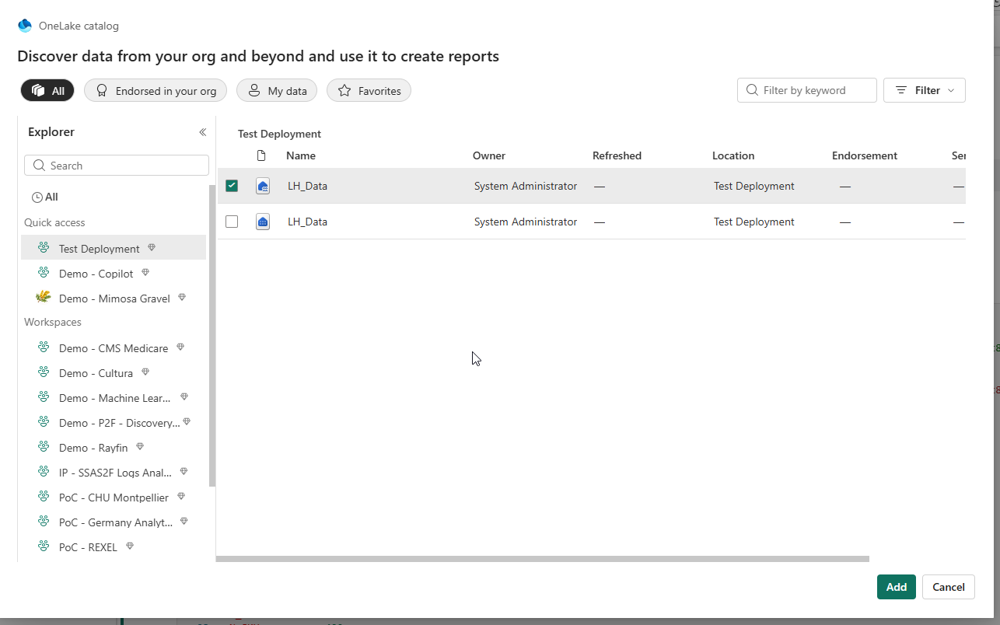
9. Once bound, you should see it on the left pane. 
Obtain the **ABFS Path** of the **Files** folder:
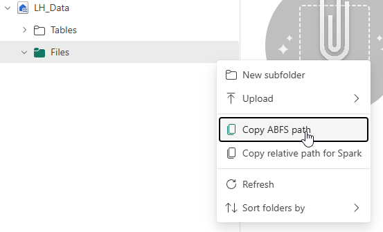
and copy it inplace of the BASE_PATH variable row 6 of the first notebook cell:
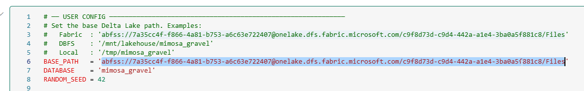
9. Start the notebook using the **Run all** button at the top. 
10. Once over, come back to the workspace, and refresh the semantic model by using the refresh button next to the Semantic model name. 
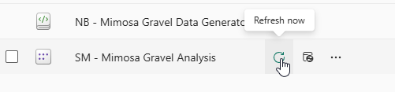

> The Generate data notebook populates with fake data our Sales & Retail Model. We are now ready to start working with a Data Agent ! 

---

## Build and Use a Microsoft Fabric Data Agent

This guide walks you through creating a **Fabric Data Agent** end to end: from setting up a workspace to publishing an agent that answers natural-language questions over your data.

> **What is a Fabric Data Agent?**
> A Fabric Data Agent lets business users ask questions about their data in plain language. It uses AI to translate questions into queries against your semantic models, lakehouses, and warehouses, then returns answers, tables, and visuals. 

### 1. Open the Data Model and Look at the Tables

The **semantic model** defines the tables, relationships, and measures the agent understands.

1. In the created workspace, from the item list, open the **semantic model** (Data model) item.
2. Here you can review the following elements:
- Tables and their **relationships**.
- Inspect key tables (for example, `Sales`, `Product`, `Customer`, `_Measures`).
- Review the **columns** (KPIs) defined on each table and **measures** in the dedicated table.
- Note the **naming** — clear, business-friendly names help the agent answer accurately.

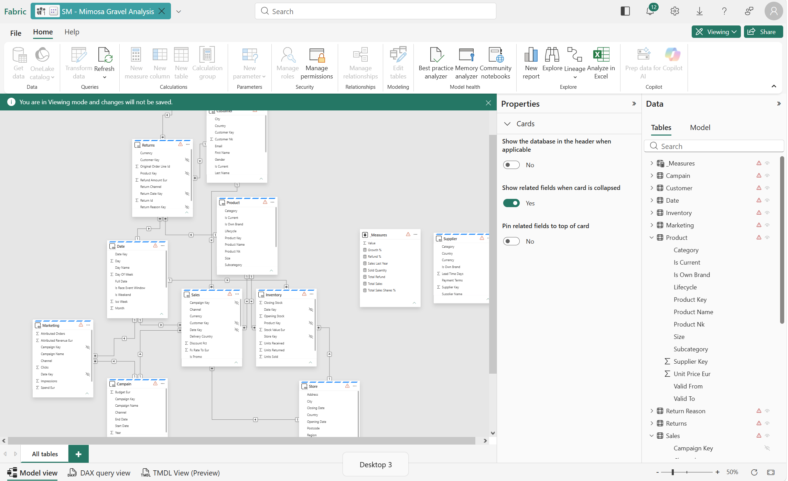

> Good, descriptive table and column names dramatically improve the agent's accuracy.

### 2. Open the Report and Understand the KPIs

The report shows how the data is used today and which metrics matter.

1. Open the **Power BI report** in the workspace.
2. Review the main **KPIs** (for example, total sales, revenue by category, sales by family).
3. Note how measures are **sliced** — by product, family/category, region, or time.
4. Keep these KPIs in mind — they are the same questions you'll ask the agent.

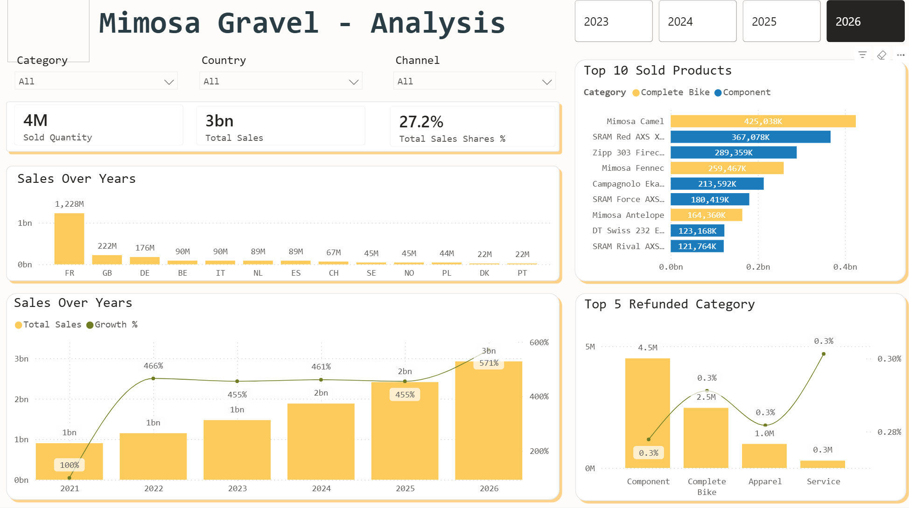

### 3. Create the Data Agent

It's now time to create the agent that will answer questions about your data.

1. In the workspace, select **+ New item**.
2. Search for and choose **Data agent** (may appear under **Data Science** or **AI**).
3. Give the agent a **name** (for example, `Sales Assistant`).
4. Select **Create**. The Data Agent authoring canvas opens.

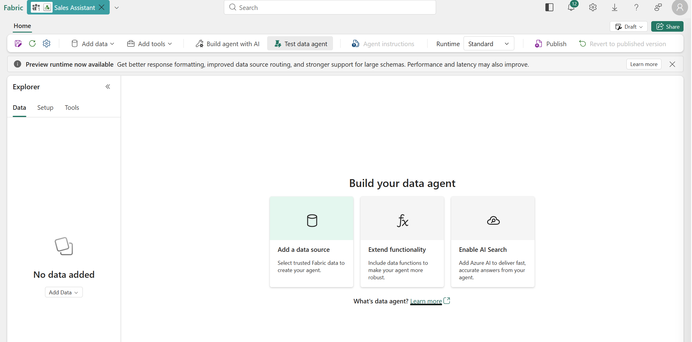

### 4. Add Data from the Semantic Model

Give the agent something to reason over.

1. In the agent canvas, select **Add data source** (or the **+** in the data sources pane).
2. Choose your **semantic model** from previous step.
3. Then, after it's loaded, select the **tables** you want the agent to use : `_Measures` & `Product` at first. 
4. The agent now has access to those tables and measures.

> Only add the tables the agent needs. Fewer, well-chosen tables produce clearer answers.

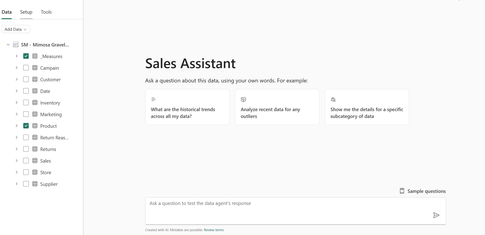

### 5. Ask a first question

Test the agent with a simple, direct question.

1. In the chat panel, type a question that maps to a known KPI, for example:
   > *"What are the total sales in 2025?"*
2. Review the answer, and expand the **query/steps** the agent generated.
3. Confirm the number matches the report from previous step (in the Power BI report).

<div class="tip" data-title="Tips">

>
> Always check the generated query the first few times to verify the agent's reasoning.
>

</div>

You can check it in the Power BI report here:
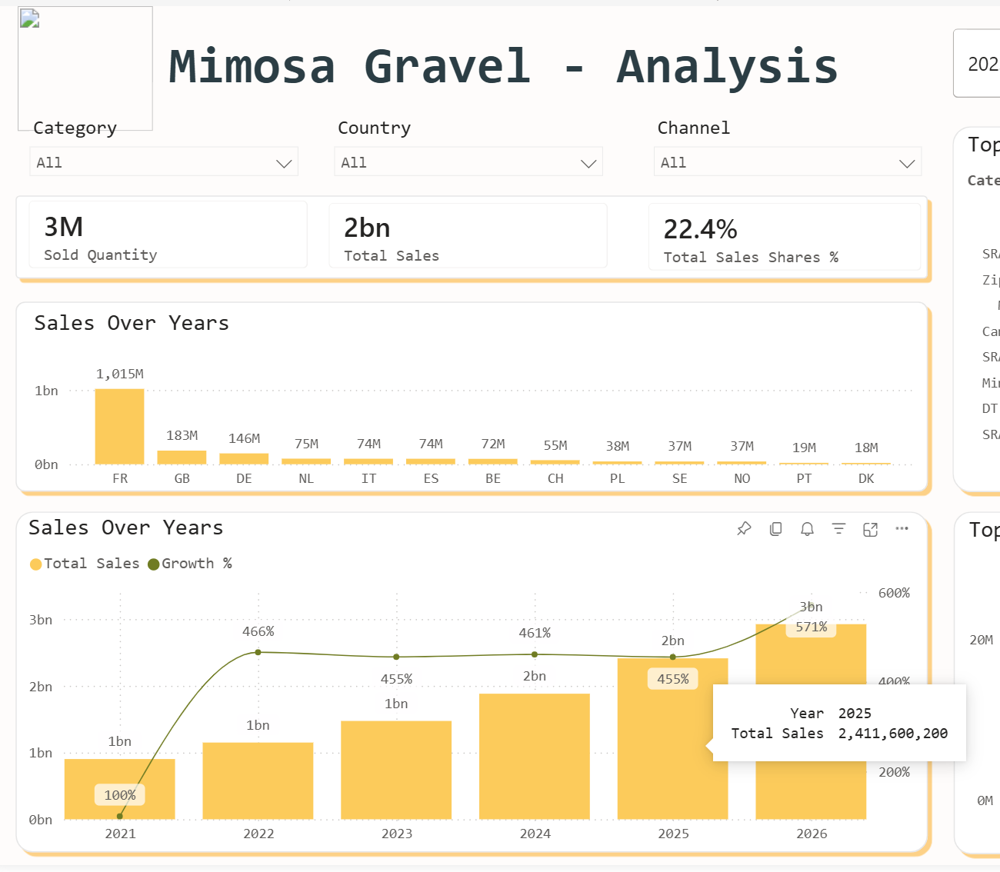

### 6. Add your first instruction

Let's customize the agent's behavior using the **Instructions**. This teach the agent about your business context and how to behave.

1. Click on the **Agent instructions** on top of the agent.
2. Add a clear, plain-language rule, for example:
   > *"You are a Sales Analyst Agent responsible for insights and key influencers identifcation. Use a profesional tone. Come back with precise and short answers and do not try to invent any figures."*
3. The save will be done automatically, and the agent will now follow your instructions.

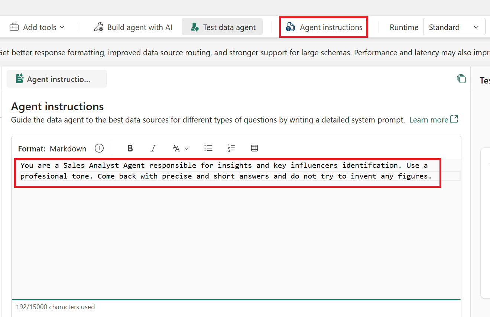

4. Verify the instruction took effect ; ask a question that relies on your new instruction, for example:
   > *"Show me sales by month."*
6. Confirm the new tone you should see something like this : 
   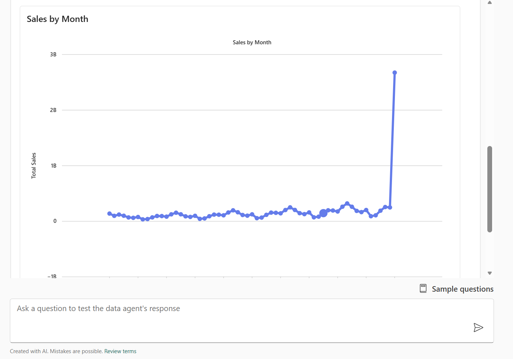
7. Reopen the instructions, erase what you have written, and replace it by what is written here : 

```markdown
### General 
- You are a Sales Analyst Agent responsible for insights and key influencers identifcation. 
- Use a profesional tone. 
- Come back with precise and short answers and do not try to invent any figures. 

### KPIs 
- When prompting answers about KPis, always provide sales in K€ (thousands) + percentages with 2 decimals after comma. 
- Sales Performance should always use the [Total Sales]
- When no date period is defined, use the current year value and propose a year to date when Growth is asked.
```

8. Verify the instruction took effect ; clear the chat with the top right button to start with an empty history and ask the same question that relies on your new instruction :
   > *"Show me sales by month."*

9. Compare the result with the previous two instructions. 
Now you should see a more precise answer with the right format, here is an example of what you should see : 
   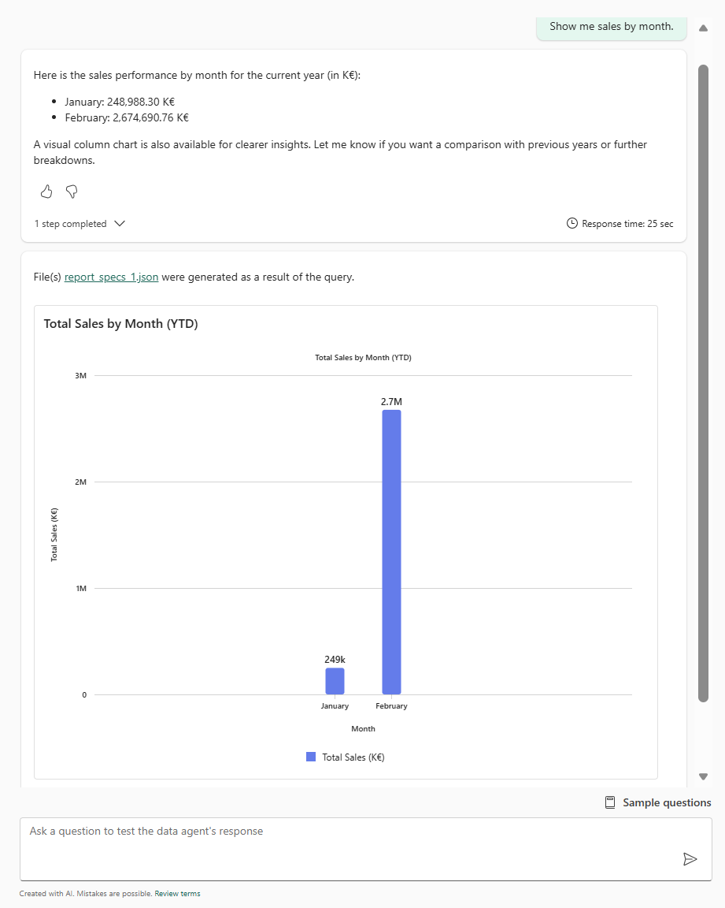

<div class="tip" data-title="Tips">

>
> Instructions are the single most powerful lever for improving answer quality. Be specific.
>

</div>

### 7. Ask a Question About "Family"

Now test a term the agent may not yet understand, and teach the agent your domain vocabulary.

1. Ask a question using business terminology, for example:
   > *"Which product family had the highest sales?"*
2. Observe the result. If the agent misinterprets **"family"** (for example, confusing it with category or product name), that's expected — you'll fix it next.
3. Add clarifying rules, for example:

```markdown
### Tables 
- Sales is a fact table defining retail performance indicators  
- Products contains all sold products in the company. 

##### Products 
- Family is a synonym for 'Product'[Subcategory] column.

##### Sales 
- When prompt refers to a country name, translate the country name to 2 characters country code ('France' ==> 'FR') and map to the Sales[Delivery Country]
```

4. **Clear the session** with the broom at the top right of the page. Open the **Instructions** pane again.
5. Repeat the question from previous step:
   > *"Which product family had the highest sales?"*
6. Confirm the agent now groups by the correct **Product Subcategory** column and returns an accurate answer.

> Compare before and after — this shows the direct impact of good instructions.

<div class="tip" data-title="Tips">

>
> The agent is able to assume some functional pattern, but giving it a functional context will help it to understand the business context and the data model.
>

</div>


### 8. Add a Table from the Lakehouse

Extend the agent beyond the semantic model by adding raw data.

1. In the data sources pane, select **Add data source** → **Lakehouse**.
2. Choose the lakehouse you created in previous step.
3. Under **Schemas** > **mimosa_gravel** > **Tables**, Select the tables named `dim_return_reason` and `fact_returns`. If tables doesn't appear, refresh the lakehouse by clicking on the refresh button next to the lakehouse name.
4. It should look like this :

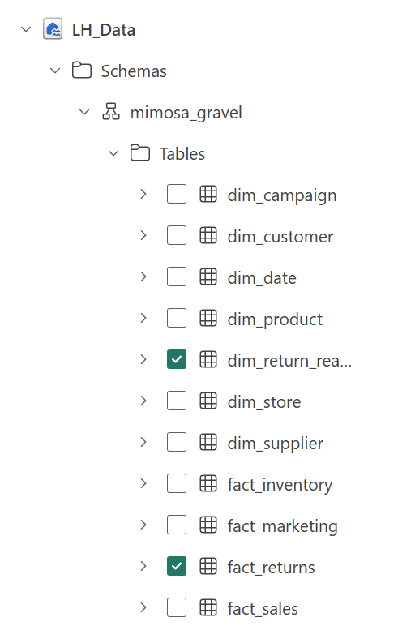

> Data Agents can combine multiple sources — semantic models, lakehouses, and warehouses — in one agent.

### 9. Add a SQL Sample Query

Inside the **Setup** tab do to **Example queries** show the agent how to query a source correctly.

1. In the Explorer on the left, you can now see a new menu called Example Queries. Open **Example queries**.
2. Add a query and in the question, paste the following text : 
 >"Give me the quantity of product returned, by product category and return reason."
3. Add a representative query with a plain-language description, for example:

```sql
    SELECT DISTINCT category, reason, COUNT(1) AS quantity
    FROM mimosa_gravel.fact_returns AS r
    LEFT OUTER JOIN mimosa_gravel.dim_product AS p
    ON r.product_key = p.product_key
    LEFT OUTER JOIN mimosa_gravel.dim_return_reason AS rr
    ON r.return_reason_key = rr.return_reason_key
    GROUP BY category, reason
```

4. This will be auto saved.

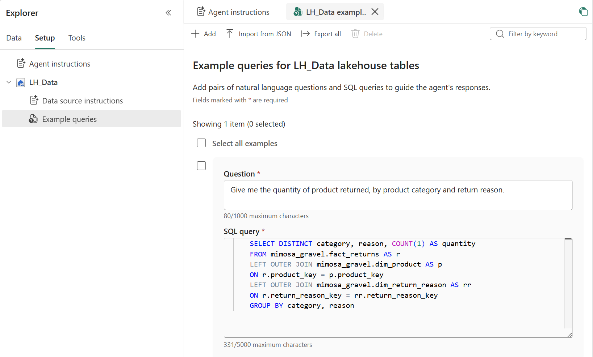

> Sample queries teach join patterns and column usage, improving accuracy for lakehouse/warehouse sources. When an agent receive a question that is similar to a sample query, it will use the sample query as a reference to generate the answer.

### 10. Ask a Question Against the New Source

1. Ask a question that requires the lakehouse table, for example:
   > *"Give me the quantity of product returned, by product category and return reason."*
2. Confirm the agent uses the lakehouse table by taking a look at the steps completed, at then end of the answer, and check if it follows the pattern from your sample query.

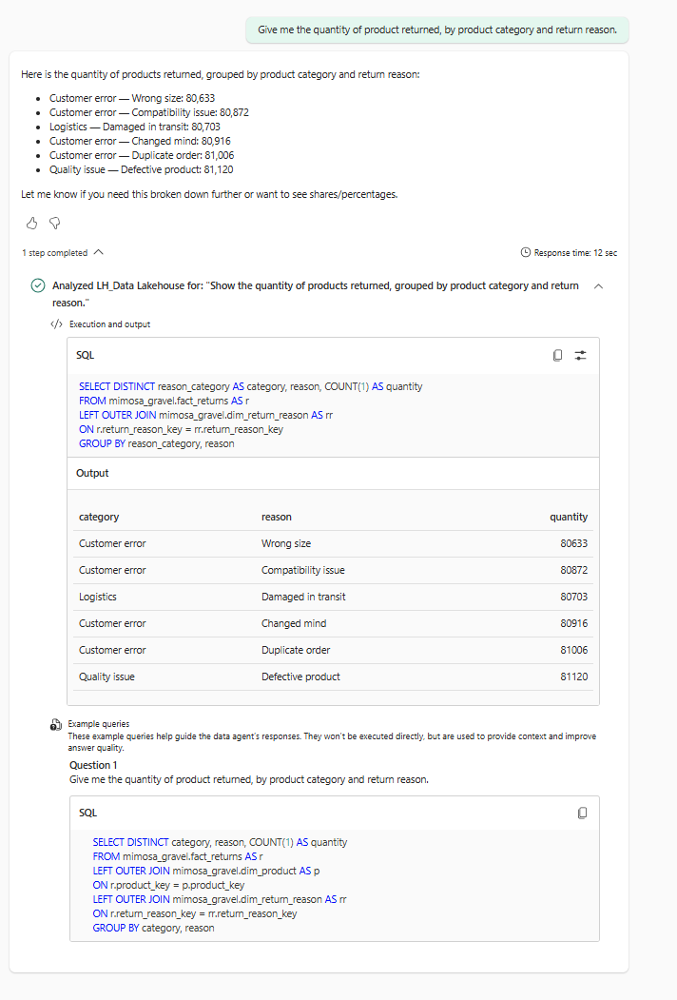

### Summary

You have:

1. Created a capacity-backed **workspace**.
2. Imported and run a **notebook** to build data.
3. Explored the **semantic model** and **KPIs**.
4. Created a **Data Agent** and added a **semantic model** source.
5. Improved answers with **instructions** and domain **vocabulary**.
6. Extended the agent with a **lakehouse table** and a **SQL sample query**.

<div class="tip" data-title="Tips">

>
> Tips for great data agents
>
> - **Iterate on instructions** — most quality gains come from clear, specific instructions.
> - **Use business language** in table/column names and instructions.
> - **Add sample queries** for every non-trivial lakehouse/warehouse source.
> - **Verify generated queries** early to build trust in the answers.
> - **Keep sources focused** — add only the tables users actually ask about.
>

</div>

### Further Reading

- [Fabric Data Agent overview](https://learn.microsoft.com/fabric/data-science/concept-data-agent)
- [Create a Fabric Data Agent](https://learn.microsoft.com/fabric/data-science/how-to-create-data-agent)
- [Data Agent instructions and best practices](https://learn.microsoft.com/fabric/data-science/data-agent-scenario)

---

## Connect Fabric Data Agent to the orchestrator agent

Your orchestrator already reasons over the company guidelines and the Foundry IQ knowledge base. In this lab, you give it a new tool: querying the **Fabric Sales Data Agent** you published earlier. Instead of duplicating the sales logic inside the orchestrator, you expose the Fabric agent as a tool through its **Model Context Protocol (MCP)** endpoint, so the orchestrator can delegate any sales or product question to it and combine the answer with the rest of its context.

### Publish the Fabric Data Agent

The first things you need to do, is to make the agent available to your users. Go back to your Fabric workspace and select your **Sales Assistant** data agent.

1. In the agent canvas, select **Publish**.
2. Add a **description**, this is mandatory as it will allow other agent to consume this one as an external agent:
> This agent analyses the sales across the retail operations of the mimosa gravel retailer.
3. Confirm **Publish**.
4. Go back to your workspace and in the Data agent line, share access with your audience. Grant the appropriate **permissions**:
    - **Share**: Share this data agent with other people. 
    - **View Details**: View the configuration and settings, but make no changes.

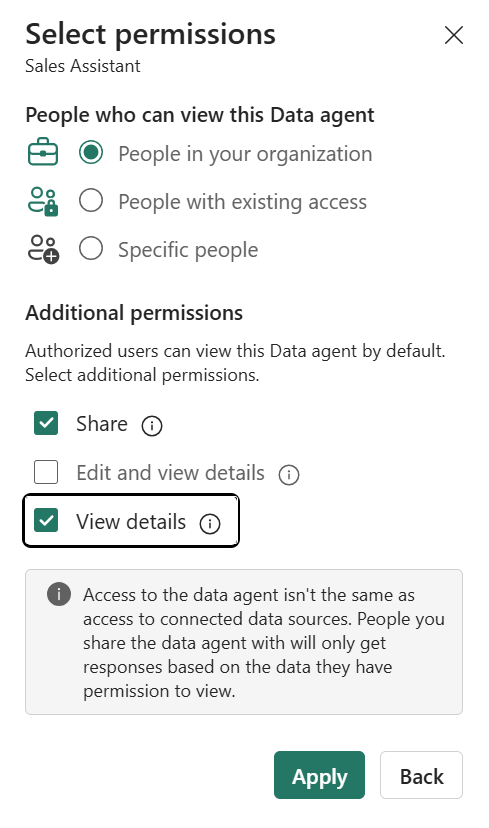

> Only users with permission to the underlying data sources can get answers. Verify sharing at both the agent and data-source level.

### Files To Open

You stay in the same file as the previous labs:

- `src/agents/main.py`
- `src/.env`

### Get the MCP endpoint

A published Fabric Data Agent exposes a single MCP tool over streamable HTTP. You need its endpoint URL before you can call it.

1. Go back to [Fabric Portal](https://app.fabric.microsoft.com) and open the **Sales Assistant** data agent you published in the previous lab.
2. Open its **Settings** and go to the **Model Context Protocol** tab.
3. Copy the **MCP server URL**. It follows this pattern:

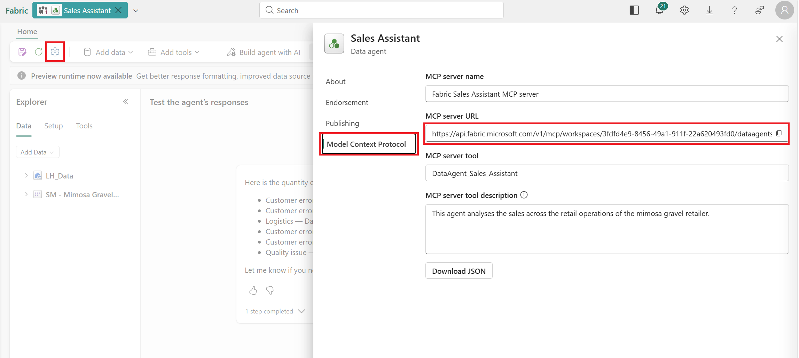

4. Paste it into your `.env` file as `FABRIC_SALES_AGENT_ENDPOINT`.

### Acquire a Fabric Token

Every request to the MCP endpoint must carry a bearer token for the Fabric API. Unlike the other Azure SDK clients you used so far, the MCP transport is a plain HTTP client, so you acquire the token yourself and pass it in the `Authorization` header.

Open `src/agents/main.py` and find the first placeholder, right below the `credential` creation. Replace it with:

```python
async def get_fabric_token() -> str:
    access_token = await credential.get_token(
        "https://api.fabric.microsoft.com/.default"
    )
    return access_token.token
```

The `https://api.fabric.microsoft.com/.default` scope is what tells Microsoft Entra you want a token for the Fabric API. Because it reuses the same `credential` as the rest of the app, the Fabric agent runs with the caller identity, and it only answers when that identity has access to the workspace and the data agent.

### Register the Fabric Data Agent as a tool

Now turn the MCP endpoint into a tool the orchestrator can call. Find the second placeholder and replace it with:

```python
fabric_token = asyncio.run(get_fabric_token())
fabric_http_client = AsyncClient(
    follow_redirects=True,
    timeout=Timeout(30.0, read=300.0),
    headers={"Authorization": f"Bearer {fabric_token}"},
)
fabric_sales_agent = FabricDataAgentMCPTool(
    name="Sales Agent",
    description="A sales agent that can provide information about products and sales reports.",
    url=fabric_sales_agent_endpoint,
    http_client=fabric_http_client,
)
tools.append(fabric_sales_agent)
```

You build a dedicated `AsyncClient` with the `Authorization` header so that **every** request the MCP transport makes — the initial handshake, the tool discovery, and each tool call — carries the token. The generous read timeout leaves the data agent enough time to translate your question into a query and run it. Appending the tool to the `tools` list you created in the first labs is what makes it available to the orchestrator alongside the guidelines tool.

<div class="tip" data-title="Why a custom FabricDataAgentMCPTool?">

> The tool uses `FabricDataAgentMCPTool` (provided in `src/agents/utils/fabric_mcp_tool.py`) instead of the framework's `MCPStreamableHTTPTool`. The Fabric MCP server does not implement the JSON-RPC `ping` health-check yet as the service is in preview at the time of writing this lab and answers it with an HTTP `400`, which would tear down the connection. The custom subclass simply skips that proactive ping while keeping the normal reconnect-and-retry behavior.

</div>

The `description` matters: it is what the orchestrator model reads to decide when to route a question to the Fabric agent, so it should clearly state what the agent knows.

### Run The Agent

```bash
cd src/agents
uv run python main.py
```

DevUI opens again, this time with the orchestrator wired to the guidelines tool, the identity-aware search provider, and the Fabric Data Agent.

<div class="task" data-title="Validation">

> Ask a sales question that only the Fabric Data Agent can answer, for example: *"What are the total sales in 2025?"*
>
> Confirm the orchestrator calls the **Sales Agent** tool and returns the figure from Fabric (formatted in K€, following the instructions you gave the data agent).

</div>

If it answers correctly, you should see:

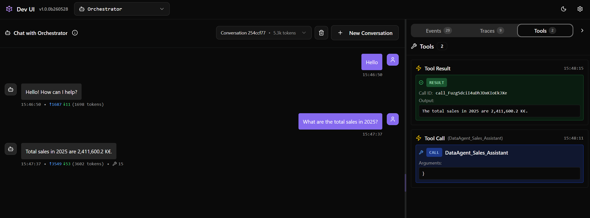

You now have a multi-agent system: a Foundry orchestrator that grounds its answers on company guidelines and knowledge bases, and delegates business questions to a Fabric Data Agent over MCP.

---

## Bonus: Discover Microsoft Fabric RTI (Real-Time Intelligence) 


### What you will learn in this lab

This guide walks you through building a **Real-Time Intelligence (RTI)** solution in Microsoft Fabric: streaming live weather data into an **Eventstream**, landing it in an **Eventhouse**, shaping it with **KQL**, and exposing it to a **Lakehouse** through **OneLake availability**.

> **What is Real-Time Intelligence?**
>
> RTI is the Fabric workload for ingesting, storing, and analyzing high-volume, time-based data. **Eventstreams** move events, **Eventhouses/KQL databases** store and query them at scale, and **KQL** (Kusto Query Language) powers fast analytics over streaming data.

The goal of the lab is to present the basics of Event House and real time data management :  
- You will ingest data via a dedicated data stream called Event Stream 
- You will implement a Medaillon-like Architecture : 
    - Store Raw Data into a first layer, as-is, without any transformation or filters 
    - Refine Data in a dedicated table, and auto update via Update Policies new data in a Silver Layer. We will also present a way to ingest historical data with functions. 
    - Present data to end users via Materialized Views, automated storage layer that will benefit from aggregations and scalar functions 
    - And Eventually expose our Real Time data with Batch data from our Lakehouse via One Lake Availability.   

### 1. Create an Eventhouse

The **Eventhouse** is the storage and analytics engine. Creating one automatically provisions a **KQL database**.

1. In your workspace, select **+ New item**.
2. Search for and choose **Eventhouse**.
3. Give it a name (for example, `Weather_Eventhouse`) and select **Create**.
4. When it opens, note the **KQL database** created inside it (same name by default). You'll write all KQL against this database.

You should see something like this:
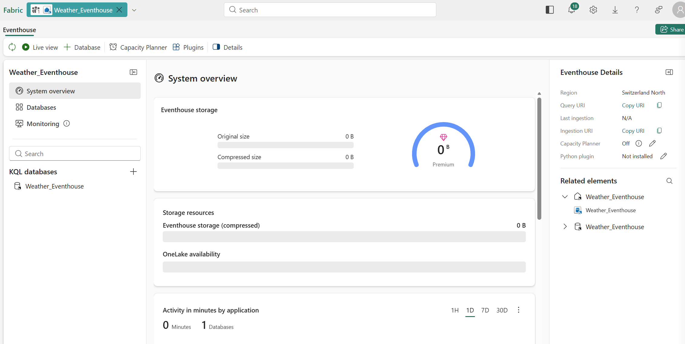

> The Eventhouse can hold many KQL databases. For this workshop we use the default one.

### 2. Create an Eventstream

The **Eventstream** ingests events from a source and routes them to destinations.

1. In your workspace, select **+ New item**.
2. Search for and choose **Eventstream**.
3. Give it a name (for example, `Weather_Eventstream`) and select **Create**.
4. The Eventstream authoring canvas opens with an empty **Source → Destination** design surface:

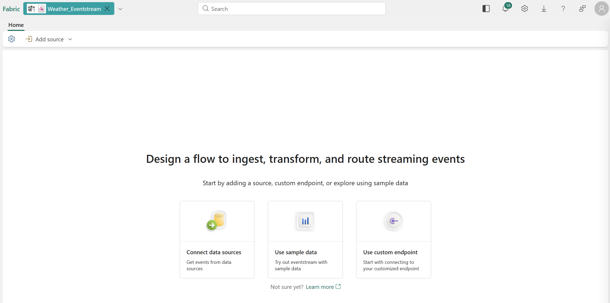

### 3. Add a Real-Time Weather Source (Paris, FR)

1. On the canvas, select **Add source** → **Connect Datasource** 
2. Chose **Real-time Weather** in the list of Recommended Datasources.
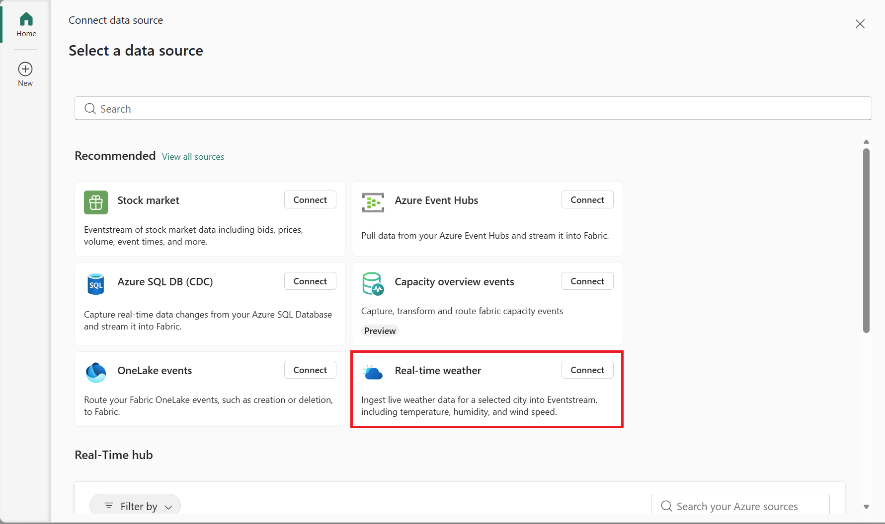
3. In the location pane, search for **Paris** and choose Paris in France.
4. Name the source (for example, `Paris_Weather`).
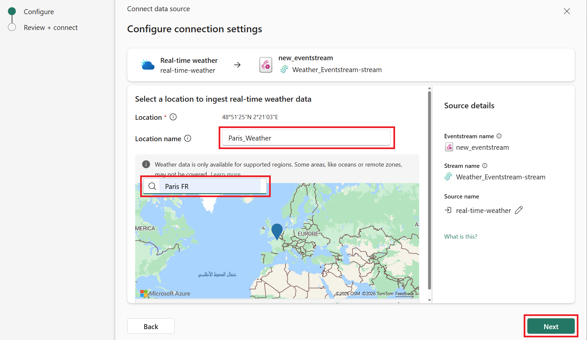
5. Click **Next** and then **Add** to add the source to the canvas.
6. You should see the datasource created and look at the Data Preview pane at the bottom. You should see live data:
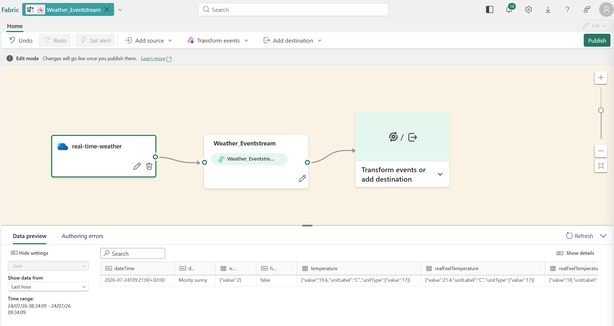

> The raw data you see with JSON will be used to map the fields in KQL in the next steps.

### 4. Load Data into a Raw Table in the Eventhouse

Route the stream into the Eventhouse as a **raw landing (bronze) table**.

1. On the Eventstream canvas, select **Transform events or add destionation** and at the bottom, chose **Eventhouse**.
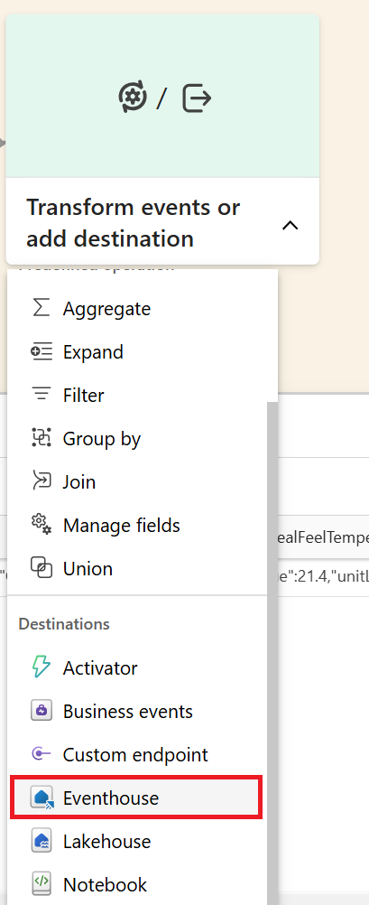
2. Choose **Event processing before ingestion** (or **Direct ingestion**).
3. Select your **workspace**, the **Eventhouse** previously created, and the **KQL database**
4. Pick **Create new** in **KQL Destination table**. 
5. Create a new destination table named `WeatherRaw` and click **Save**:
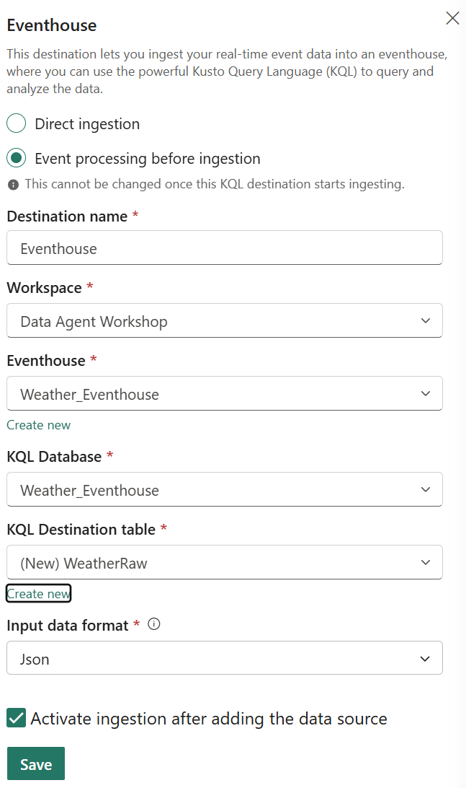
6. At top right corner, click **Publish** the Eventstream and confirm events start flowing. You should see something like this:
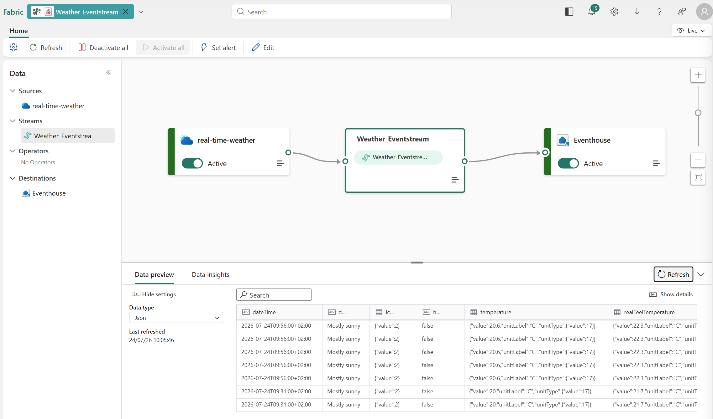
7. Come back to the Event House (either from the workspace, or from the quick menu). 
8. On the left, open the KQL Database, and click on the query set. (If you followed the naming, it would be called `Weather_EventHouse_queryset`)
9. Wait a minute or two, then verify rows arrive inside it by removing default queries and replace it with `WeatherRaw | count`. You should see something like this (the number of rows will vary based on how long you waited):
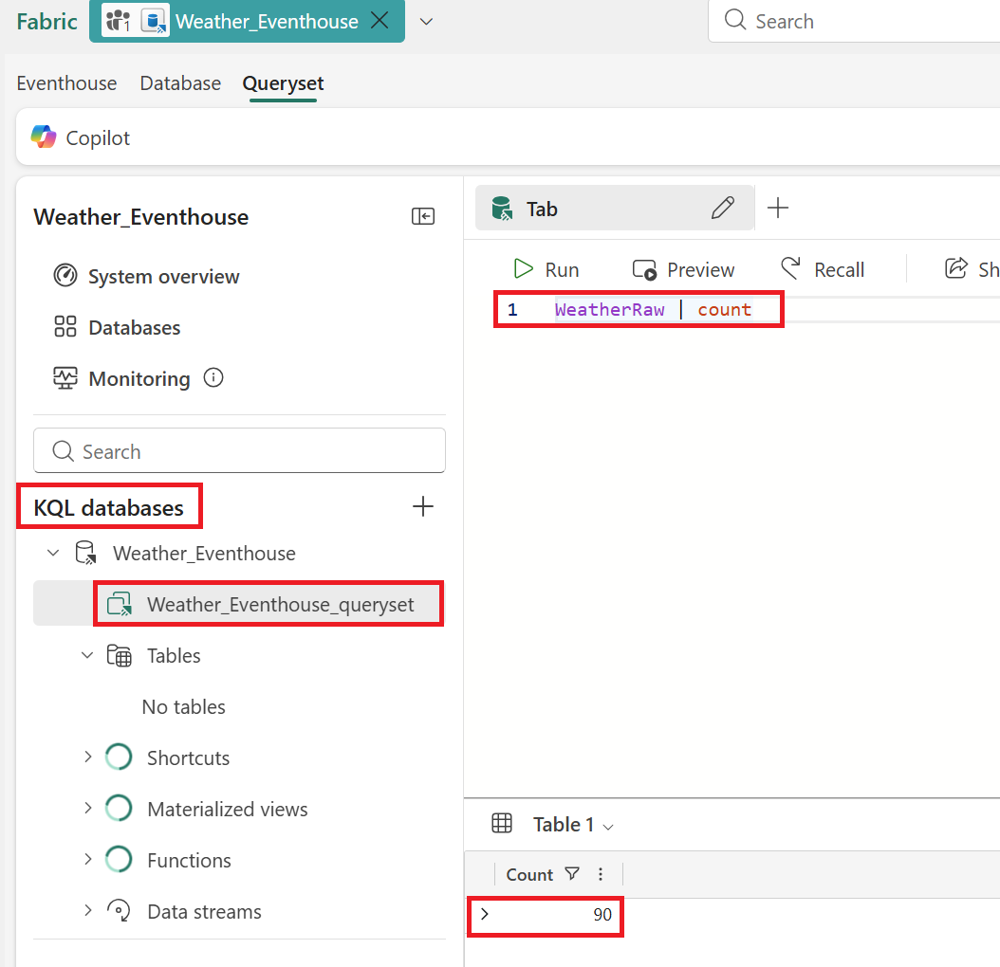

### 5. Query the Data Using KQL

1. Stay in the Eventhouse and let's continue to do some queries.
2. Run a few basic queries:

```kql
// Peek at the latest raw events
WeatherRaw
| take 10

// Count events landed in the last 15 minutes
WeatherRaw
| where ingestion_time() > ago(15m)
| count
```

> `ingestion_time()` is a hidden column that tells you when each record landed — handy for validating a live stream.

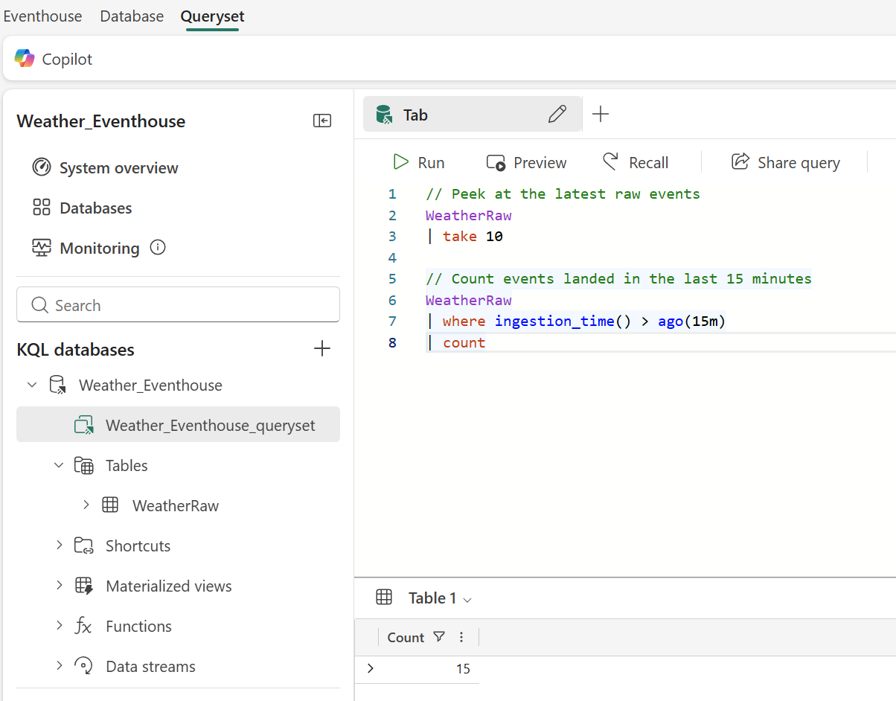

3. KQL database comes with a lot of functions and inline command. To check the schema of the table, use the following code : `WeatherRaw | getschema`
4. Notice that the raw schema comes from the EventStream handling. 

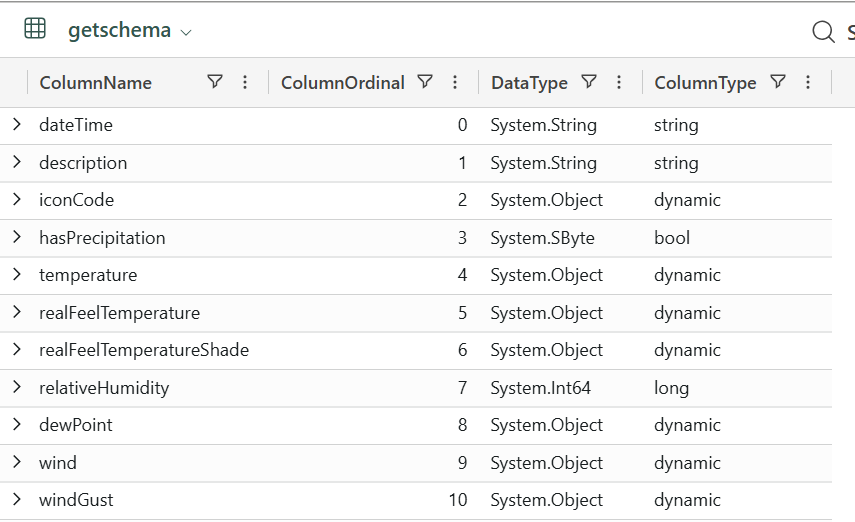

### 6. Create a Second-Layer (Silver) Table

#### Create the WeatherSilver Table

Shape the raw JSON into a clean, typed **silver table**. The `WeatherRaw` table exposes the fields sent by the Real-time Weather source: scalar columns (such as `relativeHumidity`, `uvIndex`, `cloudCover`, `hasPrecipitation`, `daytime`) and dynamic objects (such as `temperature`, `wind`, `dewPoint`) that wrap their reading in a `value` property.

Run this query to create a typed table with the fields for the `WeatherSilver` table:

```kql
.create table WeatherSilver (
    City: string,
    ObservedAt: datetime,
    Description: string,
    TemperatureC: real,
    RealFeelC: real,
    Humidity: long,
    DewPointC: real,
    WindSpeedKmh: real,
    WindGustKmh: real,
    UvIndex: long,
    CloudCover: long,
    HasPrecipitation: bool,
    IsDaytime: bool
)
```

> Typed columns make queries faster and enable relationships with dimension data.

#### Use an Update Policy to Populate the Silver Table

An **update policy** automatically transforms rows from the raw table into the silver table on ingestion.

1. Create a transformation function that maps raw JSON to typed columns, copy paste and run the following code in the KQL query window:

```kql
.create function WeatherRawToSilver() {
    WeatherRaw
    | project
        City = tostring(locationName),
        ObservedAt = todatetime(dateTime),
        Description = tostring(description),
        TemperatureC = toreal(temperature.value),
        RealFeelC = toreal(realFeelTemperature.value),
        Humidity = tolong(relativeHumidity),
        DewPointC = toreal(dewPoint.value),
        WindSpeedKmh = toreal(wind.speed.value),
        WindGustKmh = toreal(windGust.speed.value),
        UvIndex = tolong(uvIndex),
        CloudCover = tolong(cloudCover),
        HasPrecipitation = tobool(hasPrecipitation),
        IsDaytime = tobool(daytime)
}
```

2. Attach the update policy to `WeatherSilver`, sourced from `WeatherRaw`, run the following code in the KQL query window:

```kql

.alter table WeatherSilver policy update
\```
[
  {
    "IsEnabled": true,
    "Source": "WeatherRaw",
    "Query": "WeatherRawToSilver()",
    "IsTransactional": false,
    "PropagateIngestionProperties": false
  }
]
\```

```

> The workshop markdown tends to render the code with backquote complex. The string to paste should look like this (without the backslash before the backquotes): 
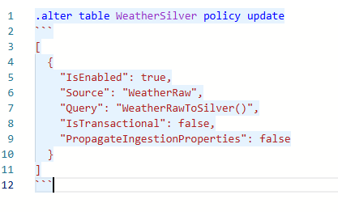

3. New rows landing in `WeatherRaw` now flow automatically into `WeatherSilver`. Run the following query to verify (it can take a few seconds for the first rows to appear):

```kql
WeatherSilver
| top 10 by ObservedAt desc
```

> Update policies run at ingestion time — historical rows already in `WeatherRaw` are **not** reprocessed automatically.

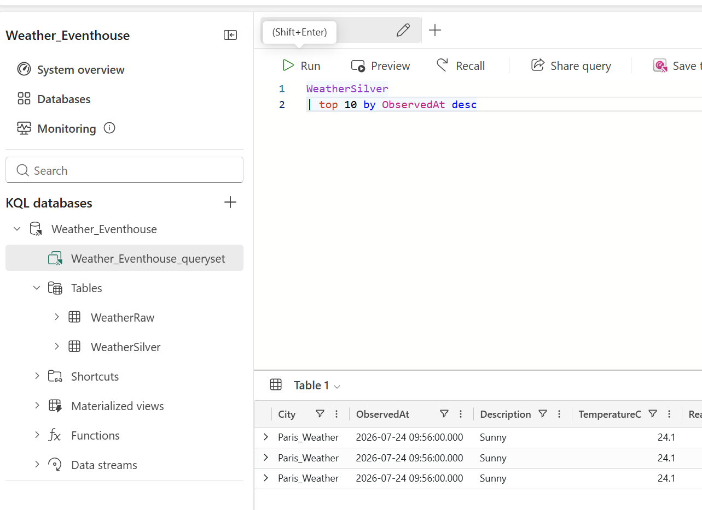

#### Backfill Historical Rows

Because the update policy only fires on new ingestion, rows that landed in `WeatherRaw` before the policy existed are missing from `WeatherSilver`. Reuse the same `WeatherRawToSilver()` function to backfill them in one command:

```kql
.set-or-append WeatherSilver <|
WeatherRawToSilver()
```

> `.set-or-append` runs the transformation function over the existing raw data and appends the typed results, so `WeatherSilver` now contains both historical and newly streamed rows. Re-run the verify query above to confirm the older records appear.

#### Create a Dimension Table

Add descriptive **dimension** data to enrich the weather facts.

```kql
.create table DimCity (
    City: string,
    Country: string,
    Region: string,
    Latitude: real,
    Longitude: real
)

.ingest inline into table DimCity <|
Paris,FR,Île-de-France,48.8566,2.3522
```

Join the dimension to your silver facts:

```kql
WeatherSilver
| join kind=inner DimCity on City
| project ObservedAt, City, Country, Region, TemperatureC, WindSpeedKmh, Humidity
| top 10 by ObservedAt desc
```

> Dimension tables let you filter and group weather metrics by country, region, or coordinates.

### 7. Aggregate with a Materialized View

A **materialized view** keeps a continuously updated projection for fast reads.
If you read the table WeatherSilver, you will notice that the events in the EventStreams contain duplicate values per ObservedAt. Let's keep only one row per date observation — the latest values for each `ObservedAt`:

```kql
.create materialized-view WeatherHourly on table WeatherSilver
{
    WeatherSilver
    | summarize take_any(*) by ObservedAt
}
```

> `take_any(*) by ObservedAt` collapses every duplicate of the same timestamp into a single row. Because materialized views can't use non-deterministic functions such as `ingestion_time()`, this is the supported KQL pattern for keeping one value per key.

Query the view like any table:

```kql
WeatherHourly
| order by ObservedAt desc
| take 100
```

> Materialized views are ideal for dashboards — they precompute the deduplicated result so reports stay fast even as data grows.

### 8. Enable OneLake Availability and Link to a Lakehouse

Expose the KQL data in **OneLake** so a **Lakehouse** (and other engines) can read it.

1. In the Eventhouse, open the **KQL database** settings.
2. Turn on **OneLake availability** (Delta Lake) for the database (or for specific tables such as `WeatherSilver`).
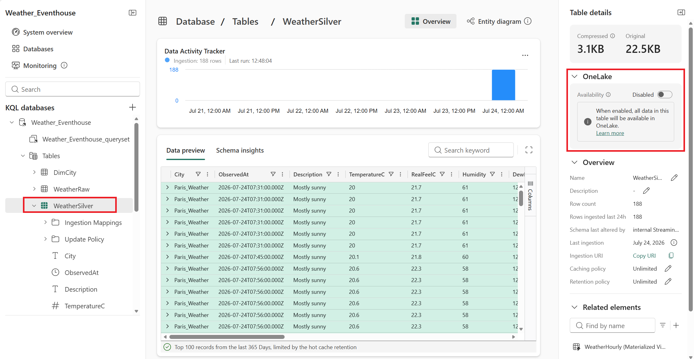
3. Wait for the mirroring status to show the tables are available in OneLake.
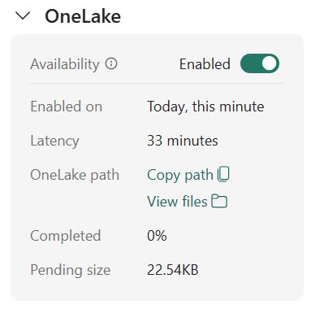
4. Create a **Lakehouse** in the workspace and call it `LH_WeatherSilver`.
5. Under **Tables**, select **New shortcut** → **Microsoft OneLake** and leave default options.
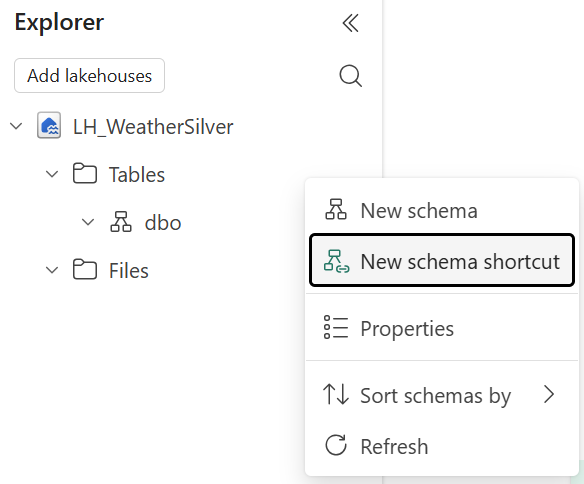
6. Browse to your **KQL database**, select the `WeatherSilver` and `DimCity` tables, and create the shortcut.
7. Confirm the tables appear in the Lakehouse and can be queried with **SQL** or a **notebook** — no data copy required.

> OneLake availability writes KQL data as Delta tables, so the same weather data is instantly usable across Lakehouse, Warehouse, and Power BI.

### Summary

You have:

1. Created an **Eventhouse** and **KQL database**.
2. Created an **Eventstream** and connected a **real-time weather source** for Paris, FR.
3. Landed events in a **raw (bronze) table** and queried them with **KQL**.
4. Built a **silver table** populated by an **update policy**.
5. Added a **dimension table** and joined it to the facts.
6. Aggregated data with a **materialized view**.
7. Enabled **OneLake availability** and linked the data to a **Lakehouse** via a shortcut.

<div class="tip" data-title="Tips">

>
> - **Land raw, transform in layers** — keep a bronze table, then refine with update policies.
> - **Use update policies** for lightweight, per-ingestion transformations; use materialized views for aggregations.
> - **Type your columns** in silver tables for faster queries and cleaner joins.
> - **Enable OneLake availability** to share streaming data across Fabric without copies.
> - **Bin by time** (`bin(Timestamp, 1h)`) to power time-series dashboards efficiently.
>

</div>

### Further Reading

- [Real-Time Intelligence overview](https://learn.microsoft.com/fabric/real-time-intelligence/overview)
- [Create an Eventhouse](https://learn.microsoft.com/fabric/real-time-intelligence/create-eventhouse)
- [Eventstream sources and destinations](https://learn.microsoft.com/fabric/real-time-intelligence/event-streams/overview)
- [KQL update policies](https://learn.microsoft.com/kusto/management/update-policy)
- [Materialized views](https://learn.microsoft.com/kusto/management/materialized-views/materialized-view-overview)
- [OneLake availability for KQL databases](https://learn.microsoft.com/fabric/real-time-intelligence/one-logical-copy)


---

## Closing

Once you're done with this lab you can delete the resource group you created at the beginning.

To do so, click on **Delete resource group** in the Azure Portal to delete all the resources at once. The following Az-Cli command can also be used to delete the resource group:

```bash
# Delete the resource group with all the resources
az group delete --name <resource-group>